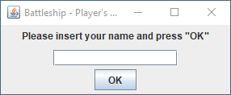
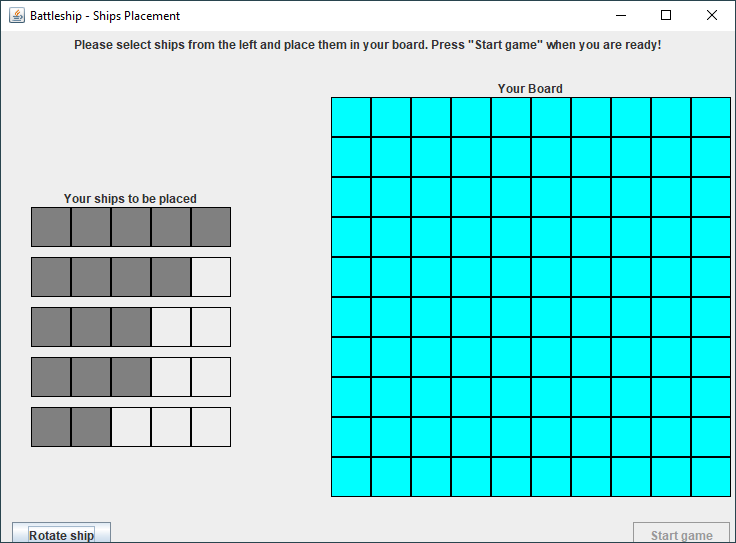
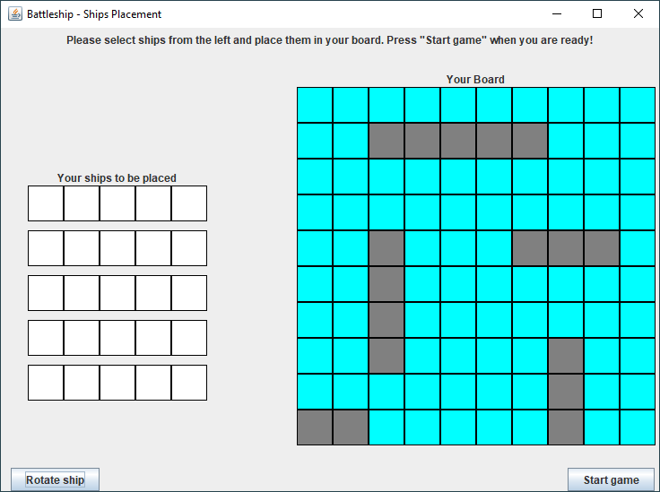
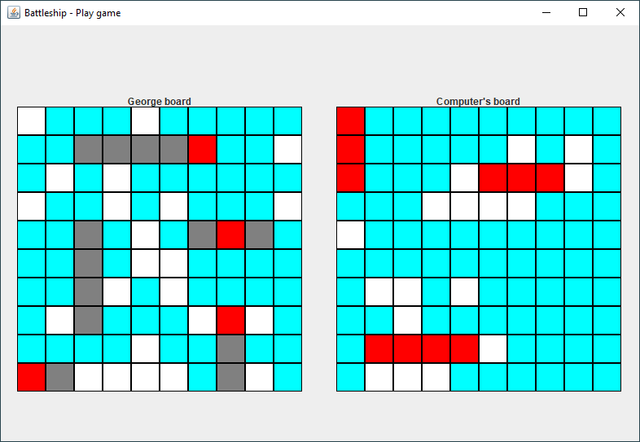
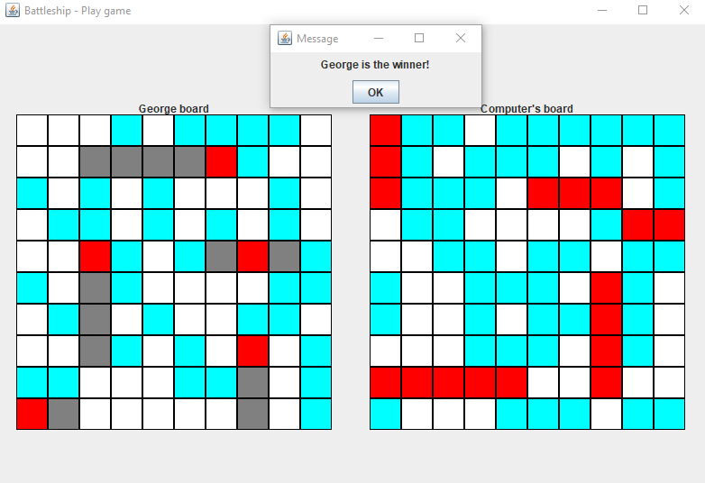

# Java Battleship Game

Java Battleship is the simple classic battleship game that has developed with Java and Swing.

## Description

Java Battleship is a simple game that is developed with Java and Swing Library. Just download Battleship.jar to play it or download the core files in [/battleship](https://github.com/georgealexakis/java-battleship-game/tree/master/battleship) folder to modify it.

## Screenshots

## License

This project is licensed under the MIT License - see the [LICENSE](LICENSE) file for details.
